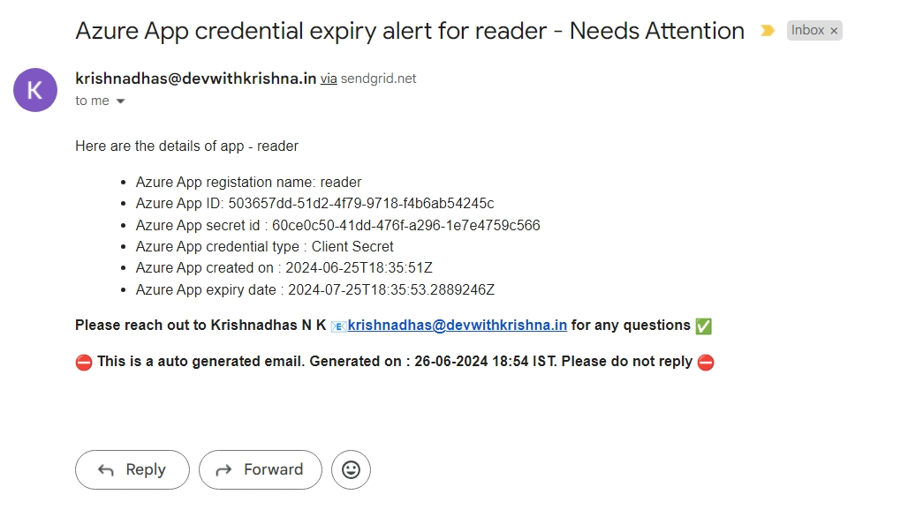

# azure-app-registration-monitor
This project automates the monitoring of Azure app registrations, identifying those set to expire in the next 14 days. It sends notification emails to the app owners and generates a detailed expiration report

# How the code works

* Basically python uses Microsoft Graph API to query details of App registrations from Azure
* Authenticaton was done using service principal credentials and msal libray
* `confidential_client_secret.py` returns the access token to be used by graph API
* First we query `https://graph.microsoft.com/v1.0/applications` end point to get details of app registrations except 
    owner details.
* later we use `https://graph.microsoft.com/v1.0/applications/{object_id}/owners` end point supplied with the object id of app
    to get the owner details
* we will calculate the expiry of app is in how many days from today

| Email            | Days to expiry | Status |
|------------------|----------------|--------|
| :heavycehckmark: | <0             | Expired |
| :heavycehckmark: | 0-14           | Critical |
| :heavycehckmark: | 14-30          | Needs attentions |
|                  | 30 or more | No Immediate action is required |
|  | -- | if secrets are not created - NA |

* This code will send email to owners of the service principal to the owners except if expiry date is more than 30 days.


* This will generate a report and send it to admin as well.

# SendGrid 

```
SendGrid is a cloud-based service that provides email delivery and management for businesses. Sendgrid is used to send email
using its python SDK - sendgrid
```

# Credentials used for authorization

| credential                    | purpose                                                    | check              |
|-------------------------------|------------------------------------------------------------|--------------------|
| Azure Service principal       | to generate access token for microsoft graph api           | :heavy_check_mark: |
| sendgrid api key              | this is used for mailing purpose to auth with user account | :heavy_check_mark: |

#### .env
```commandline
AZURE_TENANT_ID="xxx"
AZURE_CLIENT_ID= "xxx"
AZURE_CLIENT_SECRET = "xxx"
AZURE_SUBSCRIPTION_ID = "xxx"
SENDGRID_API_KEY ="xxx"
```
**Replace the values with proper value.**

➡️ These values are read as environment values using `os.getenv('variable')` method leveraging load_dotenv()

# Files

* app_registrations.py ➡️ queries azure entra id to get details
* confidential_client_secret.py ➡️ This creates the access token for Graph Api
* send_email.py ➡️ sends a email to owner of app registration
* send_email_report.py ➡️ sends a report email to admin email
* date_time.py ➡️ this does some date time calculations required
* email_template.html ➡️ email html template
* email_report_template.html ➡️ email report html template

